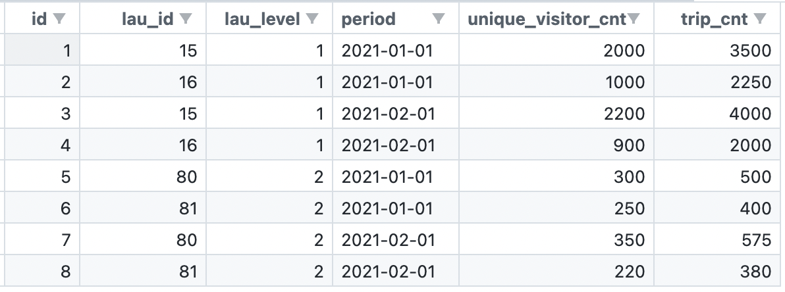

# MPDSamplingStatistics
This program is a tool to compare different Mobile Positioning Data (MPD) based results between eachother, conduct statistical tests and output a .csv file with different statistical indicators.

## Input

In order to compare two or more sets of results to the first set of results, two databases or multiple schemas in one database are used. The choice of databases/schemas is specified in the config file, but <b>the format of the tables should be the same for different sets of results </b>(otherwise you couldn't compare them).

Many forms of tables are suitable for input in this program. The following is one example:

...where `lau_id` is the id of the administrative unit that has a particular indicator, `lau_level` refers to the local administrative unit level of a select country, period refers to the time of the particular indicator, and `unique_visitor_cnt` and `trip_cnt` are the indicators or 'results' that will be compared between two tables.

One script could compare multiple tables from multiple schemas to a set of original results with the same number of tables.

## Output

The script joins indicators from two to many input sources according to the table and join parameters. Then it calculates aggregate statistics from the differences of the input sources. In the end, the script outputs a file (.csv) in which statistics for every possible category and filter value are provided. 

An example of an output file is the following:

The description of statistical tests and parameters is below the heading 'Statistical Tests'.

An example of visualizing output files is given in the Jupyter Notebook `results_visualization_example.ipynb` that is located in the main folder.

## Running
To run the program, navigate to the project directory in your terminal and run the following command:

    python main.py -c ./configs/your_config_name_here.yaml

This will produce an output file with a path that is specified in the config. <b>NB!</b> You will have to create your own config, as every database connection and setup is different. Two configs 'config.yaml' and 'config_2_databases.yaml' are in the ./configs folder as examples of how to build a config.

You can also specify the maximum amount of memory to be used by the script in GBs. <b>NB!</b> This feature only works on Linux-based machines (so not on MacOS nor Windows). Here's an example that would allocate 16 GBs of memory:

    python main.py -c ./configs/your_config_name_here.yaml -m 16

## Requirements
<ul>
    <li>Python 3.7+</li>
    <ul>
        <li>pandas, pyyaml, psycopg2, scipy</li>
    </ul>
    <li>PSQL server with input data</li>
</ul>

## Testing (for developers)
To run the unittests for this program (development case), navigate to the main directory and run the following:
        
    python -m unittest

...or if you want it with a more verbose output, add a "-v" to the end of the command.

## Statistical tests

### Combination fulfillment
Firstly, a combination fulfillment test is done to make sure that even in the case of sampled/compressed data, the results include all the necessary combinations. What is meant by this is that PDM results are for a specific spatial unit (e.g. Local Administrative Unit or CGIS) and a specific point in time (e.g. April 2019) with each having separate granularities. For spatial units, three differing levels of granularity are usually available (LAU1 or counties, LAU2 or municipalities, LAU3), but for temporal units, the granularity depends on the type of results viewed. For example, tourism results have available temporal granularities of day, week, month or year, while temporary population results have much smaller temporal granularities from an hour up to a day. 

Since there are so many combinations of spatial and temporal units, then using a sample of input data for calculating results might not yield coverage over 100% of the combinations. That is why it is important to test for combination fulfillment, especially in bigger granularities, such as LAU3 and hourly breakdowns, where the margin of error might be substantial.

### Kolmogorov-Smirnov
Secondly, a two sample Kolmogorov-Smirnov test is conducted to sense the differences in both location and shape of the empirical cumulative distribution functions of the results calculated from 100% data and results calculated from sampled/compressed data. This test can check whether the two data sets come from the same distribution or not, so if sampled/compressed input data could give results that pass as results from 100% data, then this test needs to be passed. The null hypothesis in the KS test is that the two samples compared are from the same distribution and if the p-value for the test is below 0.05, the null hypothesis is rejected and it is concluded that these datasets are different enough that these can’t be considered similar.

### Absolute Percentage and Logarithmic Error
Thirdly, two different error metrics are calculated for each indicator in each table on each LAU level to better perceive the differences between results calculated from 100% data and results calculated from sampled/compressed data. 